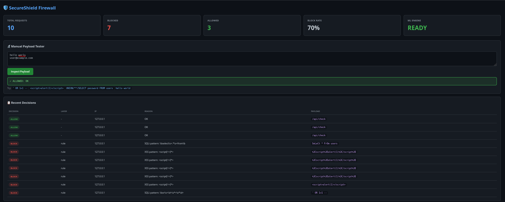

Markdown

# 🛡️ SecureShield Firewall

[](https://github.com/priyanshu8007b/SecureShield-Firewall/actions)


A **hybrid web application firewall** that blocks SQL Injection and XSS attacks using rule-based filtering combined with machine learning. Designed to be **evasion-resistant** against common bypass techniques.


---

## ✨ Features

- 🔍 **Hybrid Detection** — regex rule engine + ML classifier (TF-IDF + Random Forest)
- 🛡️ **Evasion-Resistant** — multi-pass decoding defeats URL/HTML/Unicode encoding bypasses
- ⚡ **Rate Limiting** — per-IP throttling with automatic blocking
- 📊 **Live Dashboard** — real-time stats, recent decisions, manual payload tester
- 📝 **Structured Logging** — newline-delimited JSON event logs (SIEM-ready format)
- ✅ **Tested** — comprehensive evasion bypass test suite

---

## 🚀 Quick Start

### Prerequisites

- Python 3.10 or higher
- pip
- git

### Installation

```bash
# Clone the repository
git clone https://github.com/priyanshu8007b/SecureShield-Firewall.git
cd SecureShield-Firewall

# Create and activate virtual environment
python3 -m venv venv
source venv/bin/activate         # On Windows: venv\Scripts\activate

# Install dependencies
pip install -r requirements.txt

# Train the ML model
python -m ml.train

# Run the test suite
pytest tests/ -v

# Launch the dashboard
python main.py
Open http://localhost:5000 in your browser.

🏗️ Architecture
text

                    HTTP Request
                         │
                         ▼
              ┌────────────────────┐
              │   Rate Limiter     │ ── too many requests → BLOCK
              └────────────────────┘
                         │
                         ▼
              ┌────────────────────┐
              │    Normalizer      │ ── decode evasion attempts
              └────────────────────┘    (URL, HTML, Unicode, comments)
                         │
                         ▼
              ┌────────────────────┐
              │   Rule Engine      │ ── regex pattern match → BLOCK
              └────────────────────┘
                         │ (no match)
                         ▼
              ┌────────────────────┐
              │    ML Engine       │ ── score > threshold → BLOCK
              └────────────────────┘    (TF-IDF + Random Forest)
                         │
                         ▼
                    ALLOW + LOG
See docs/ARCHITECTURE.md for full architectural details.

🛡️ Evasion Resistance
SecureShield handles common bypass techniques that defeat naive WAFs:

Technique	Example	Blocked
Case mixing	SeLeCt * FrOm users	✅
URL encoding	%27%20OR%201%3D1	✅
Double URL encoding	%2553%2545%254C...	✅
HTML entities	&#x3C;script&#x3E;	✅
SQL inline comments	UNION/**/SELECT	✅
Unicode escapes	\u003cscript\u003e	✅
Verify yourself:

Bash

pytest tests/test_evasion.py -v

## 🤖 Machine Learning

A weighted soft-voting ensemble of 4 classifiers trained on TF-IDF character n-gram features:

| Model | Weight | Purpose |
|-------|--------|---------|
| Random Forest | 2 | Robust non-linear pattern capture |
| Linear SVM (calibrated) | 2 | High-dimensional sparse text classification |
| Logistic Regression | 1 | Probabilistic baseline |
| Multinomial Naive Bayes | 1 | Fast text classification |

| Component | Details |
|-----------|---------|
| Vectorizer | TF-IDF, character n-grams (1–4), 5000 features |
| Voting Strategy | Soft voting with weighted probabilities |
| Cross-validation | 97.84% accuracy (5-fold) |
| Internal test set | 100% (small sample, prone to overfitting) |should i add this to readme?


Bash

python -m ml.train
📊 Dashboard
The dashboard provides:

Live counters — total / blocked / allowed / block rate
ML status — model loaded indicator
Manual tester — paste any payload and see the decision
Recent decisions — last 50 inspections with reason and layer
🧪 Testing
Bash

# Run all tests
pytest tests/ -v

# Run specific suites
pytest tests/test_normalizer.py -v       # Decoding logic
pytest tests/test_rule_engine.py -v      # Pattern matching
pytest tests/test_evasion.py -v          # Bypass resistance
📁 Project Structure
text

SecureShield-Firewall/
├── firewall/
│   ├── preprocessing/        # Normalizer (evasion handling)
│   │   └── normalizer.py
│   ├── detectors/            # Detection engines
│   │   ├── rule_engine.py
│   │   └── ml_engine.py
│   ├── protection/           # Active defense
│   │   └── rate_limiter.py
│   ├── utils/                # Shared utilities
│   │   └── logger.py
│   ├── dashboard/            # Flask UI
│   │   ├── app.py
│   │   └── templates/
│   │       └── dashboard.html
│   └── engine.py             # Main orchestrator
├── ml/
│   └── train.py              # ML training pipeline
├── tests/
│   ├── test_normalizer.py
│   ├── test_rule_engine.py
│   └── test_evasion.py
├── data/                     # Datasets
├── models/                   # Trained model artifacts
├── logs/                     # Runtime event logs
├── docs/                     # Documentation
├── .github/workflows/        # CI/CD pipelines
├── config.py                 # Configuration
├── main.py                   # CLI entrypoint
├── requirements.txt
└── README.md
🛠️ Configuration
Edit config.py to customize behavior:

Python

RATE_LIMIT_MAX_REQUESTS = 100        # Requests per window
RATE_LIMIT_WINDOW_SECONDS = 60       # Window size in seconds
RATE_LIMIT_BLOCK_DURATION = 300      # Block duration after limit hit
ML_THRESHOLD = 0.5                   # Malicious probability cutoff
📜 License
This project is licensed under the MIT License — feel free to use, modify, and distribute.

👤 Author
Priyanshu — @priyanshu8007b

🤝 Contributing
Pull requests are welcome. For major changes, please open an issue first to discuss what you would like to change.

Fork the repo
Create your feature branch (git checkout -b feature/amazing-feature)
Commit your changes (git commit -m 'Add amazing feature')
Push to the branch (git push origin feature/amazing-feature)
Open a Pull Request
🙏 Acknowledgments
scikit-learn for ML pipeline
Flask for the dashboard
The OWASP community for web security standards
text


---

## How to Save It

```bash
mousepad README.md
